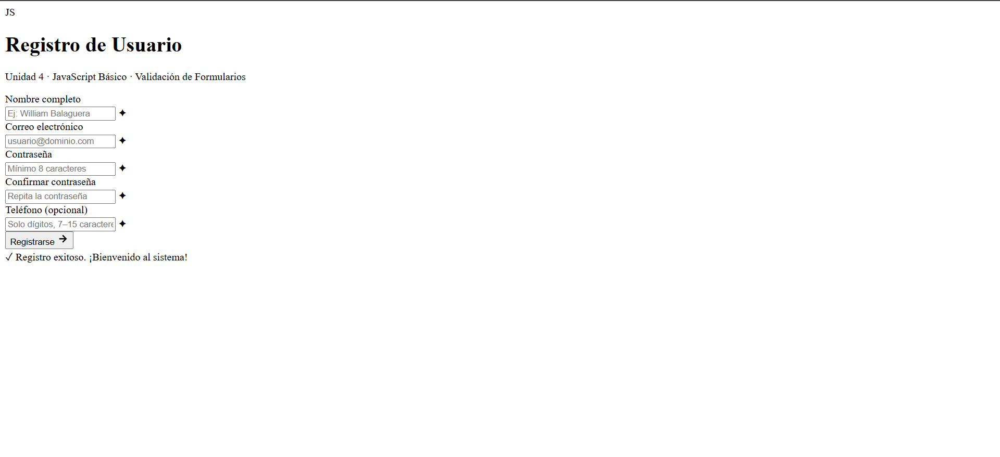
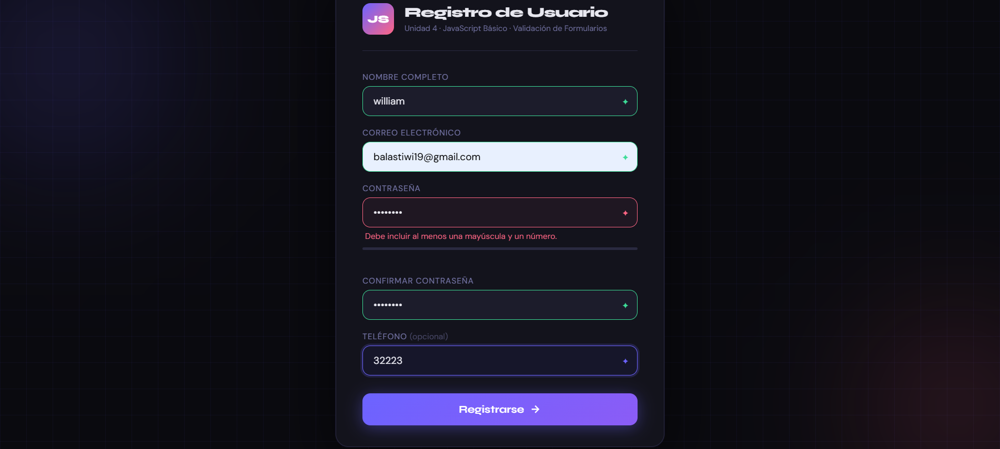
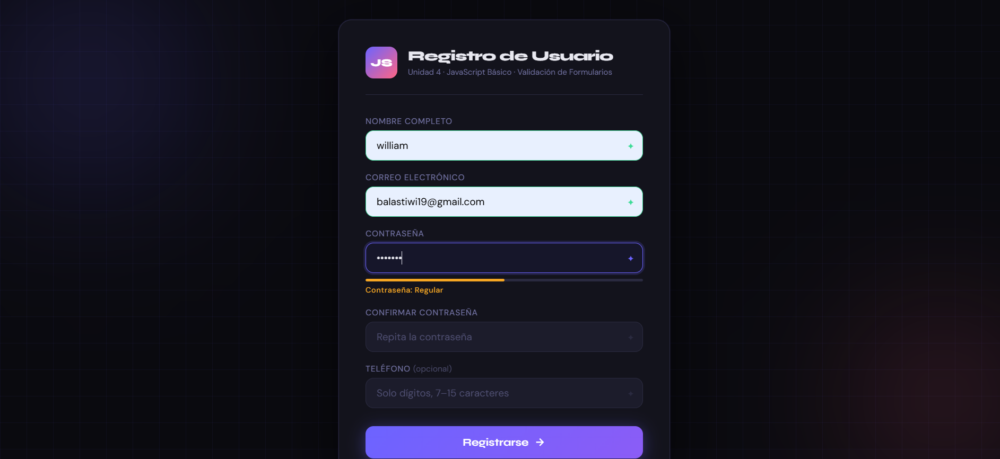

# balaguera-post2-u4

**Programación Web — Unidad 4: JavaScript Básico**  
Post-Contenido 2 · Ingeniería de Sistemas · UFPS 2026

## Descripción

Formulario de registro de usuario con validación completa del lado del cliente.
Combina la Constraint Validation API del navegador con validación manual en JavaScript.

## Características

- Mensajes de error personalizados por campo (sin usar los del navegador)
- Validación en tiempo real con el evento `blur`
- Expresión regular para contraseña (mayúscula + número obligatorios)
- Indicador visual de fortaleza de contraseña en tiempo real
- Mensaje de éxito y limpieza automática del formulario
- ES6: `const`/`let`, arrow functions, template literals, destructuring

## Instrucciones de ejecución

1. Clonar el repositorio
2. Abrir la carpeta en Visual Studio Code
3. Clic derecho en `index.html` → Open with Live Server
4. Abrir `http://127.0.0.1:5500` en Chrome

## Tecnologías

HTML5 · CSS3 · JavaScript ES6

## Autor

William Balaguera · Ingeniería de Sistemas · UFPS · 2026
## Capturas

